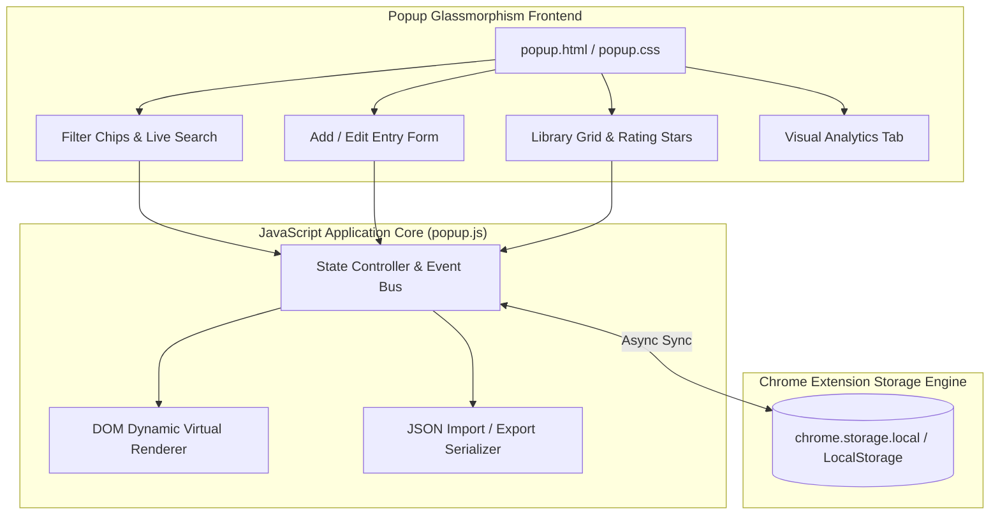

<div align="center">

# 🍿 Cine-keep — Glassmorphic Offline Watchlist Vault
### Offline-First Personal Cinema Tracking Extension Built with Chromium MV3, Chrome Storage API & Glassmorphism UI

[](https://developer.chrome.com/docs/extensions/mv3/)
[](https://developer.mozilla.org/en-US/docs/Web/JavaScript)
[](https://developer.mozilla.org/en-US/docs/Web/CSS)
[](https://github.com/harinarayana1457-cmyk/Cine-keep)
[](https://opensource.org/licenses/MIT)

<p align="center">
  <b>CineKeep</b> is a vibrant, responsive Chrome Extension engineered to catalog, rate, and curate movies and TV shows right from your browser toolbar. Featuring a sleek glassmorphic dark-mode interface, real-time poster previews, smart category analytics, and complete offline privacy with zero external tracking.
</p>

[✨ Key Features](#-key-features) • [🏛️ Architecture](#-architecture--data-flow) • [🚀 Quickstart](#️-installation--setup) • [📖 Usage Guide](#-how-to-use) • [📁 Project Structure](#-project-structure)

</div>

---

## 🌟 Key Features

* **🎨 Glassmorphic Neon Dark Mode**: Aesthetic visual styling with vibrant neon gradient borders (Pink/Purple for Movies, Cyan/Blue for TV series) and smooth micro-interactions.
* **⭐ Interactive Star Rating Engine**: Custom 5-star scoring with instant textual sentiment feedback (*Masterpiece! 🏆*, *Great Watch! 👍*).
* **🔍 Instant Search & Deep Filtering**: Real-time fuzzy query engine matching titles, review notes, and tags, with 1-click filter chips (All, Movies, TV Shows).
* **📊 Visual Library Analytics**: Live dashboard metrics computing your total watchlist count, average rating across all media, media distribution split, and top 4 genres.
* **🖼️ Dynamic Poster Art Previews**: Paste image URLs to display rich cover thumbnails, with automatic fallback to high-contrast initials gradient cards.
* **💾 Safe JSON Backup & Restore**: One-click JSON data export and import for seamless migration across browsers, complete with accidental wipe protection.
* **🔒 100% Offline & Private**: Zero cloud tracking or login requirements — your watchlist stays entirely in your browser's secure `chrome.storage.local`.

---

## 🏛️ Architecture & Data Flow



---

## 🛠️ Installation & Setup

### Prerequisites
* Google Chrome, Brave, Microsoft Edge, or any Chromium-compatible browser.

### 1. Clone the Repository
```bash
git clone https://github.com/harinarayana1457-cmyk/Cine-keep.git
```

### 2. Load into Chrome
1. Open Google Chrome and enter `chrome://extensions/` into the URL bar.
2. Toggle **Developer mode** to **ON** in the top-right corner.
3. Click the **Load unpacked** button in the top-left corner.
4. Select the cloned `Cine-keep` directory (the folder containing `manifest.json`).
5. Pin **CineKeep** to your extensions toolbar for immediate access!

---

## 📖 How to Use

### Adding an Item
1. Open CineKeep and select the **Add New** tab.
2. Enter the title and select the media format (**Movie** or **TV Show**).
3. Assign star ratings, add comma-separated genre tags, and type your personal review.
4. Paste a poster image URL for live preview card generation.
5. Click **Save to Library**.

### Managing & Sorting
* **Search**: Filter titles instantly by typing in the search box.
* **Sorting**: Sort your catalog by *Date Added*, *Rating (Highest / Lowest)*, or *Title (A-Z)*.
* **Edit / Delete**: Hover over any library card to reveal the pencil (edit) and trash (delete) icons. Deleted items provide a 4-second **Undo** safety toast!

### Backup & Synchronization
* Switch to the **Stats** tab to review your media consumption habits.
* Click **Export JSON** to download a portable backup file of your entire library.
* Click **Import JSON** to load a backup file into any browser instance.

---

## 📁 Project Structure

```text
Cine-keep/
├── icons/
│   └── icon.svg              # Vector extension logo & badge icon
├── manifest.json             # Manifest V3 extension configuration
├── popup.html                # Main extension interface layout
├── popup.css                 # Glassmorphic dark aesthetic styling & animations
├── popup.js                  # State store, search logic, and Chrome Storage sync
├── .gitignore                # Production ignore rules
└── README.md                 # Project documentation
```

---

## 📄 License & Credits

* Developed with ❤️ by **[Hari Narayana (@harinarayana1457-cmyk)](https://github.com/harinarayana1457-cmyk)**.
* Open source under the **MIT License**.